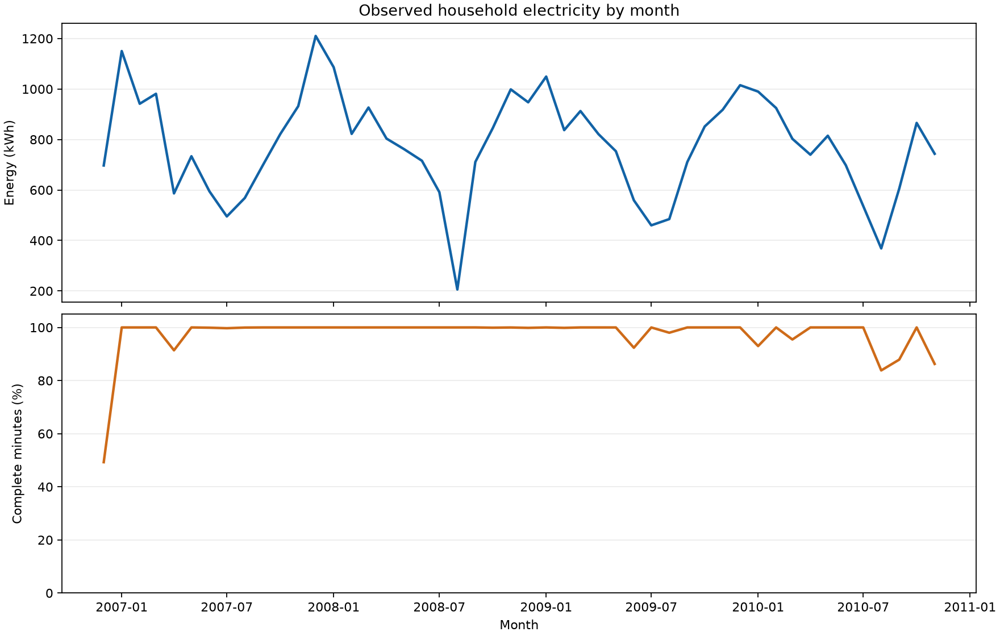
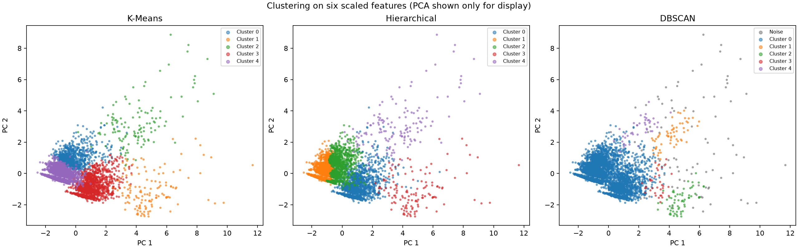

# Household Energy Consumption Analysis

An exploratory analysis of one-minute household electricity readings, followed by a comparison of K-Means, hierarchical clustering, and DBSCAN. Monthly energy charts use all complete observations; clustering uses a reproducible 5,000-row sample to keep model fitting practical.

**Explore the live analysis:** [Household Energy — interactive website](https://household-energy-analysis-yash.y63753374.chatgpt.site). It shows monthly energy and data coverage, clustering comparisons, and the five usage profiles.

## Data

Download **Individual Household Electric Power Consumption** from the [UCI Machine Learning Repository](https://archive.ics.uci.edu/dataset/235/individual+household+electric+power+consumption) with `python scripts/download_data.py`. It extracts `household_power_consumption.txt` into `data/` at the repository root. The data is not committed to Git. UCI credits Georges Hebrail and Alice Berard and licenses the dataset under CC BY 4.0.

The dataset contains minute readings from December 2006 to November 2010. `Global_active_power` is in kW; sub-metering fields are in Wh per minute. The code calculates total energy per observed minute as `Global_active_power * 1000 / 60` Wh. `Other_Wh` is the difference between that total and the three sub-meter readings; it is a residual, not a measured appliance category.

The residual is negative for a small number of minutes in the source data. The analysis reports their count and retains the calculated values so the components still sum to the measured total. Do not interpret a negative residual as negative appliance consumption.

## Run

Use Python 3.10 or newer. From the repository root:

```bash
python -m venv .venv
# Activate .venv using your shell's normal command.
python -m pip install -r requirements.txt
python scripts/download_data.py
python scripts/build_results.py
python -m unittest discover -s tests
jupyter lab
```

The download script is safe to rerun: it skips an existing data file. Use `--force` to replace it or `--output PATH` to select another location. The results script regenerates the committed CSV, JSON, and PNG files in [`results/`](results/); use `--data PATH` and `--output PATH` to override its defaults.

Open [`notebooks/ClusteringAnalysis.ipynb`](notebooks/ClusteringAnalysis.ipynb) and run all cells for the step-by-step exploration. By default it reads `data/household_power_consumption.txt`. Set the `ENERGY_DATA_PATH` environment variable to use another location. Start Jupyter from the repository root so the notebook can import `src`.

## Method and limits

1. Parse timestamps with the dataset's day/month/year format and convert `?` to missing values.
2. Drop rows with missing timestamps or measurements rather than fill readings across unrelated times. Report how many rows remain.
3. Sum observed one-minute Wh into monthly kWh. The chart reports observed energy, and its coverage table shows the fraction of calendar minutes with complete readings. Partial months and missing readings make these totals lower than a complete month.
4. Randomly sample up to 5,000 cleaned observations with seed 42, then standardize the six listed model features. No blanket outlier removal is applied, so unusual consumption patterns remain visible.
5. Fit K-Means, hierarchical clustering, and DBSCAN on the **same scaled feature matrix**. Calculate silhouette and Davies-Bouldin scores in that space. DBSCAN noise points are excluded from these scores, and its noise fraction is shown separately. Scores are unavailable when fewer than two clusters remain.
6. Use PCA only for a two-dimensional illustration, not as the model input. Profile clusters in original units for interpretation.

Clustering describes patterns in this single household; it does not identify specific appliances or forecast future usage. The chosen cluster count and DBSCAN radius are starting values to explore, not validated optima. A random sample supports exploratory comparison but is not a representative estimate of energy use over time.

## Results on the UCI dataset

The full notebook ran on the downloaded UCI data: 2,075,259 rows were loaded, 2,049,280 had complete measurements, and 1,050 complete minutes had a negative calculated residual. Observed energy across the 48 calendar months represented in the data sums to 37,283.748 kWh. The first and last months are partial, and monthly coverage also reflects missing readings.



With the 5,000-row sample, seed 42, five clusters for K-Means and hierarchical clustering, and `eps=1.5` for DBSCAN:

| Model | Clusters | Noise fraction | Silhouette | Davies-Bouldin |
| --- | ---: | ---: | ---: | ---: |
| K-Means | 5 | 0 | 0.354 | 0.944 |
| Hierarchical | 5 | 0 | 0.329 | 1.104 |
| DBSCAN | 5 | 0.018 | 0.578 | 1.191 |

DBSCAN's scores exclude noise points, so the scores do not rank the methods on exactly the same observations. The cluster profiles in the notebook are the basis for interpreting what each group represents.



The K-Means profile gives a more concrete reading of the five groups. Percentages refer to sampled minutes, not the share of total energy:

| Cluster | Sampled minutes | Mean active power | Distinguishing pattern |
| --- | ---: | ---: | --- |
| 0 | 990 (19.8%) | 0.77 kW | Moderate load with relatively high reactive power |
| 1 | 141 (2.8%) | 4.08 kW | High load with high `Sub_metering_1` (37.68 Wh/min on average) |
| 2 | 124 (2.5%) | 3.89 kW | High load with high `Sub_metering_2` (37.60 Wh/min on average) |
| 3 | 1,517 (30.3%) | 1.80 kW | Elevated `Sub_metering_3` (18.01 Wh/min on average) |
| 4 | 2,228 (44.6%) | 0.43 kW | Lower readings across the sub-metering channels |

Cluster numbers are arbitrary labels. These profiles describe measured channels rather than proving which individual appliances were running.

The committed [`summary.json`](results/summary.json) records dataset counts and run parameters. [`monthly_energy.csv`](results/monthly_energy.csv), [`clustering_scores.csv`](results/clustering_scores.csv), and [`kmeans_profile.csv`](results/kmeans_profile.csv) contain the underlying tables. These are generated outputs from the source data and scripts, not a substitute for the raw dataset.

## Repository layout

```text
data/                          Local UCI dataset (ignored by Git)
notebooks/ClusteringAnalysis.ipynb  Guided analysis and charts
results/                       Committed result tables and figures
scripts/download_data.py       Download and extract the UCI dataset
scripts/build_results.py       Regenerate tables and figures
src/energy_analysis.py         Data loading, aggregation, and model comparison
requirements.txt               Python dependencies
tests/                         Synthetic-data and workflow checks
.github/workflows/tests.yml     Automated synthetic-data checks
```

Dataset citation: Hebrail, G. & Berard, A. (2006). *Individual Household Electric Power Consumption* [Dataset]. UCI Machine Learning Repository. https://doi.org/10.24432/C58K54
